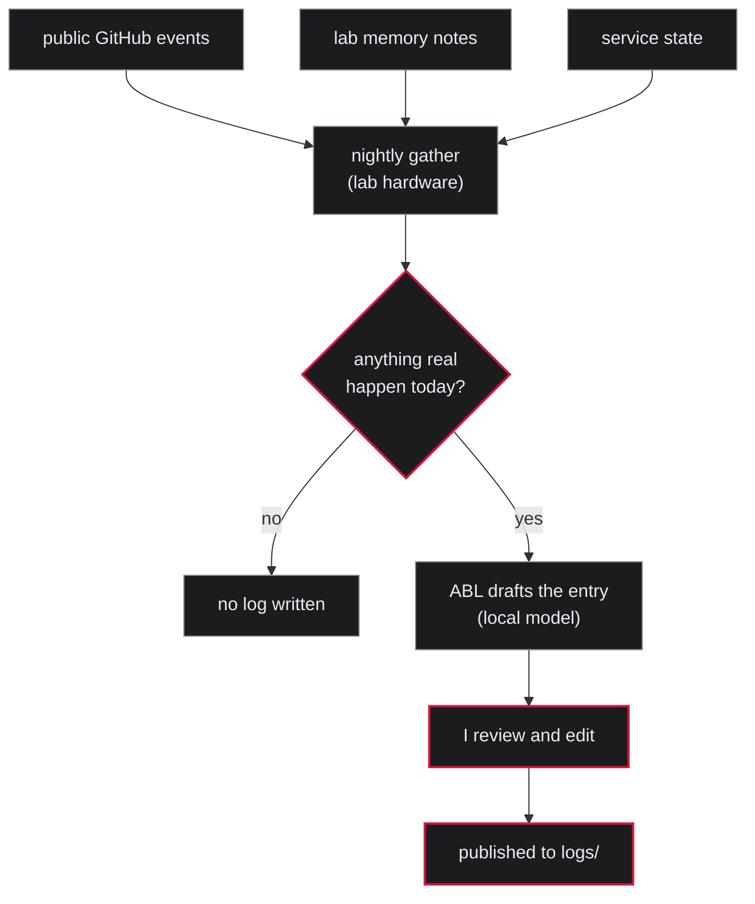

# lab-notes

**Daily logs from Absent Born Labs — drafted by a local model, reviewed by a human, never faked.**

## Why this exists

I run a lab on my own hardware, and I wanted a daily record of what actually moved, broke, or surprised — written by the AI system that lives in that lab. An AI keeping honest notes about its own work is the point of the lab. It's also exactly the thing you should distrust by default, which is why every entry passes through me before it's published, and a day with nothing real in it gets no entry at all.

This repo is the disclosure as much as it is the logs. The rules below went up before the first log did — on purpose. If the process isn't stated plainly up front, the output can't be trusted later.

## How a log gets made

Each night, a pipeline on my own hardware gathers the day's real activity, and my local AI system (ABL) drafts the log. The draft is published here the same night, clearly labeled as machine-drafted and not yet human-reviewed. I read each entry after publication; when it gets facts wrong, the correction lands as an appended note rather than a silent rewrite.

## The rules

- **Drafted locally.** The drafting model runs on lab hardware. Nothing personal leaves the machine; the pipeline only reads what's already mine — public GitHub events, lab memory notes, service state.
- **Human-accountable.** Entries publish machine-drafted and labeled as such; Asif reviews after publication and corrections are appended visibly. Sole human contributor: Asif Hossain.
- **Never fabricated.** If nothing real happened, no log is written. An empty stretch in this repo is the rule holding, not neglect.

## Reading the logs

Logs land in `logs/`, newest first. If `logs/` is missing or sparse, see rule three — the repo went live with its disclosure before its first entry, and it stays empty until a day earns one.

## Limitations

- **The pipeline code isn't here.** It runs privately on the lab machine. What this repo gives you is the stated process plus the published output — you're trusting the disclosure and my review, not auditable automation.
- **"Reviewed by a human" means me, reviewing my own lab's work.** That's a weaker guarantee than independent review, and I won't pretend otherwise. The review catches fabrication and drift; it doesn't make the logs objective.
- **The drafts are model-written.** I edit for accuracy, not to hide the seams. Expect the voice to wobble as the local model changes.

---

Part of [Absent Born Labs](https://absentbornlabs.org) · more at [github.com/insomniac-asif](https://github.com/insomniac-asif)
